## Predicting the Future Through Data Science Workspace

In this lab we will explore Data Science Workspace in Adobe Experience Platform to develop your own machine-learning model.

### Learning Objectives

- Use a pre-built ML Recipe to recommend the right product


### Lab Resources

- Adobe Experience Platform: [https://platform.adobe.com](https://platform.adobe.com)


### Story

When a customer visits multiple pages and products, what is the right decision to take regarding targeting and personalization? With Adobe Experience Platform Data Science Workspace, Analysts can now take advantage of pre-built recipes, hypertune, train and score the model to then activate the findings as part of the Real-Time Customer Profile.

In our case, the Data Scientist Team has built a Recipe. This recipe is the result of a lot of hard coding and training work. Now that the recipe is ready, it can be used by Analysts to activate it and have real predictions and recommendations become part of the Real-Time Customer Profile.

### Exercise 4.1 - Train a Model based on a Recipe

Login to Adobe Experience Platform: [https://platform.adobe.com](https://platform.adobe.com)

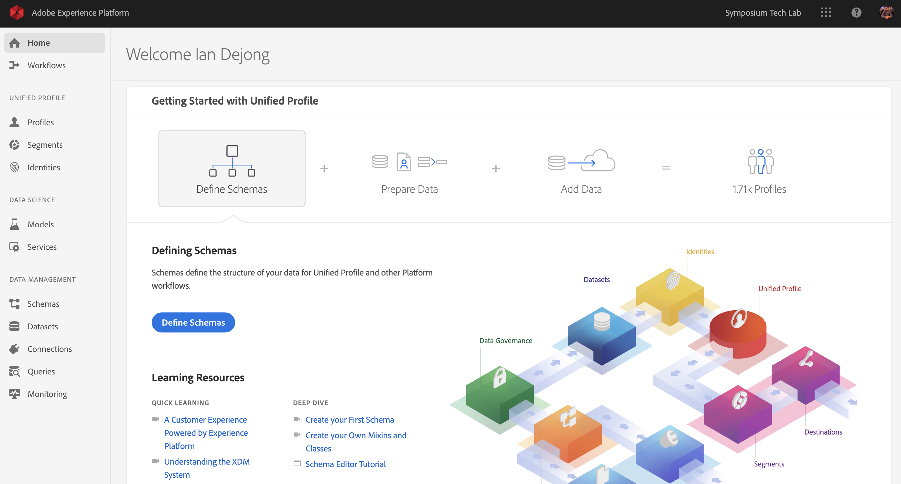

From the left menu, under 'Data Science', click on ```Models```.

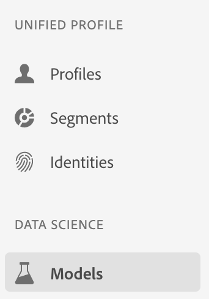

In this exercise, we'll use a prebuilt recipe to make product recommendations.
In the top menu, click on ```Recipes```.

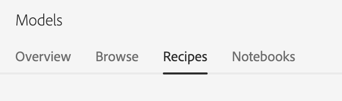

In Recipes, you'll find multiple recipes including a recipe called ```recommendations-recipe``` (the last one in the list).

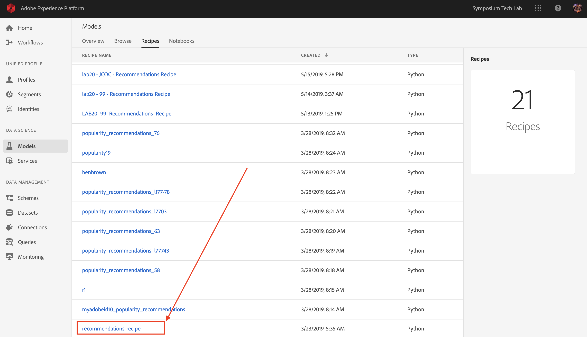

Click the ```recommendations-recipe``` to open it.

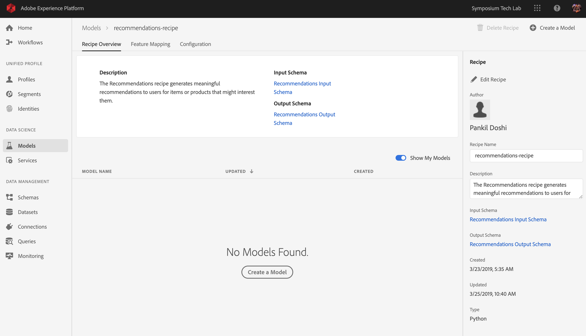

You now need to create your own Model, based on the ```recommendations-recipe```.
To do that, click on the ```+ Create a Model``` - button.

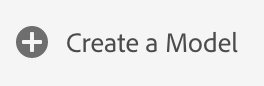

To train this model, you need to provide it with an Input Dataset. In our case, this Input Dataset was built by the Data Scientist - team and contains information around product purchase data.
The dataset to use is called ```Recommendations Input Dataset```. Select it from the list.

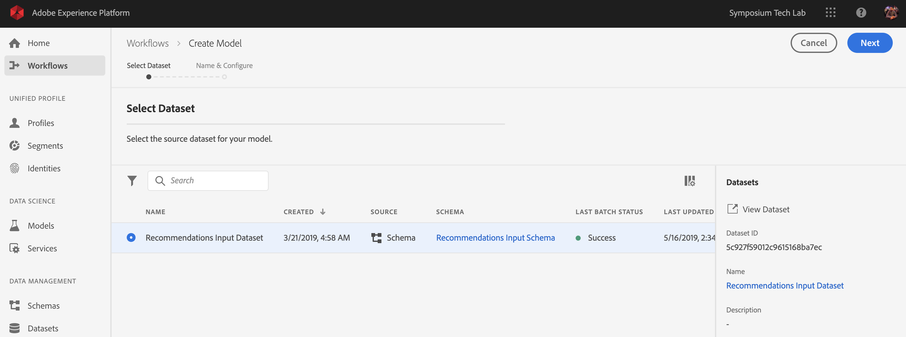

Click ```Next``` to continue.


In the next step, you need to define a name for your Model. As a naming convention, let's use: ```LAB - XX - Recommendations``` and replace XX by your computer number.

If your computer number is 1, the name becomes LAB - 01 - Recommendations.

If your computer number is 75, the name becomes LAB - 75 - Recommendations.

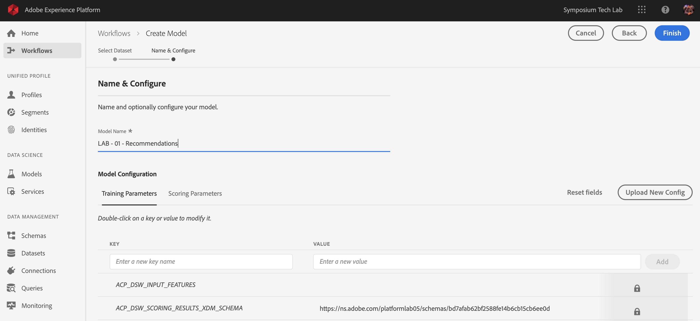

We can also hypertune the Model by changing the Model Configuration. To do that, you can change the number of recommendations and the sampling fraction.

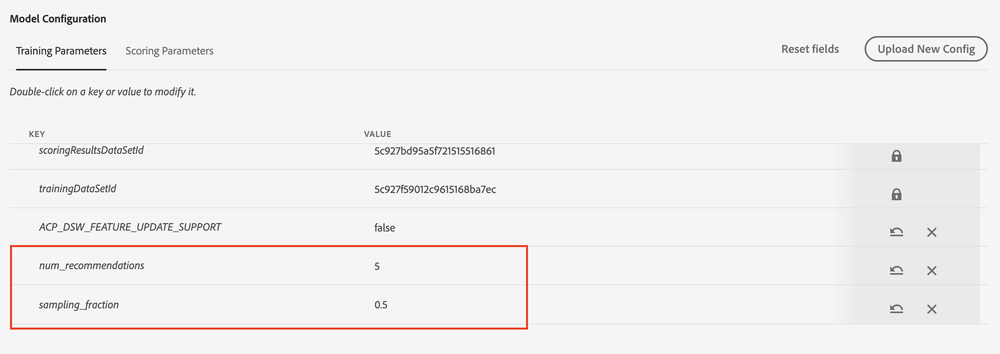

If you want to update the Model's Configuration parameters, double-click one of the parameters and give it a new value.

For instance, I'd like to have 3 recommendations with a sampling fraction of 0.8.

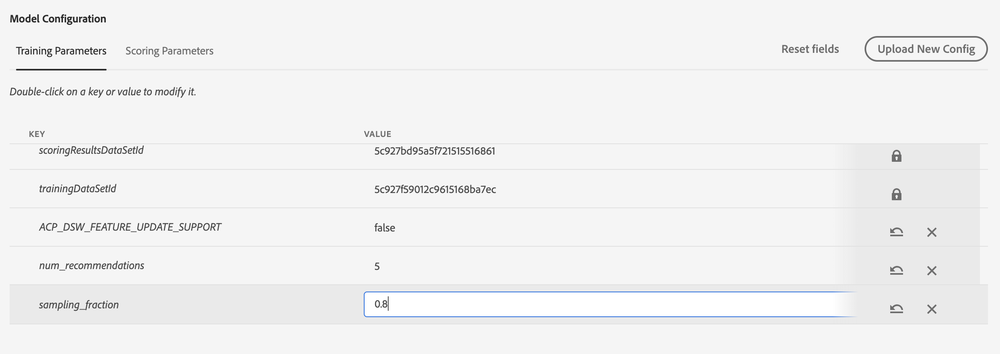

After changing these values, click ```Finish``` to finish your configuration.


After a couple of seconds, you'll be reverted back to the Model's homepage where you'll see a Training Run 1 with a status of ```Pending```. The process to finish the training run can take 5+ minutes.

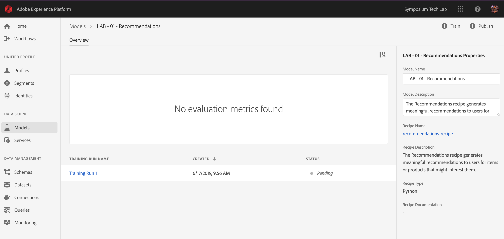

After 1-2 minutes, your Training Run's status will change to ```Running```.

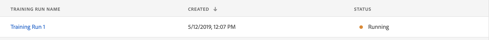

And 1-2 minutes later, the Training Run's status will change to ```Complete```.

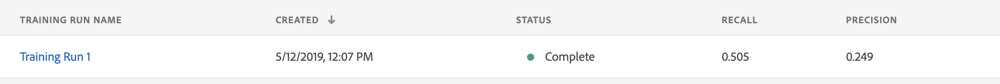

Once the Training Run has completed, you'll see a couple of metrics that indicate the quality of the run:

  * **Recall** is also known as True Positive Rate and also as Sensitivity: if the real result was Yes, how often did the model predict Yes?
  
  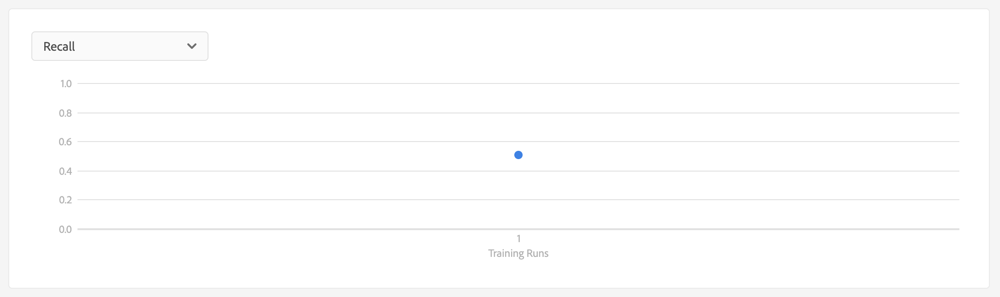
  
  * **Precision** means: When the model predicts Yes, how often is it correct?
  
  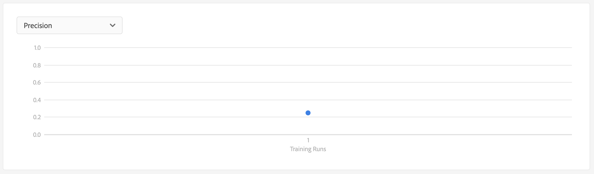

Training a model requires more than one run. All Training Runs will be visible on this page and you'll be able to compare their results, so you can decide which one is the most successfull. (In this Tech Lab, we don't have time to do multiple runs)

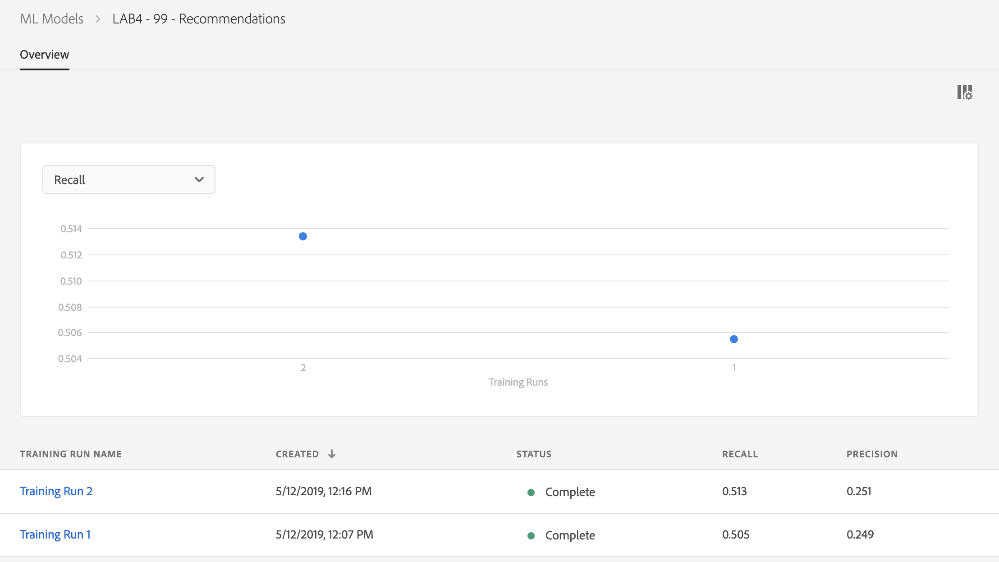

### Exercise 4.2 - Score  a Model based on a Recipe

After training a model, we can use the model to score and as such, have the model build recommendations which can be activated through targeting.

To start scoring, let's re-open Training Run 1 by clicking it.


After opening Training Run 1, you'll see a full overview of the Training Run.

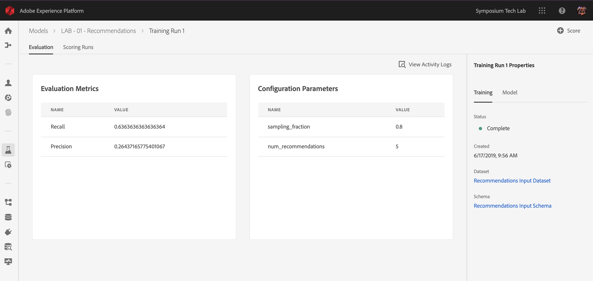

To score, you have to click the ```+ Score``` - button in the top right corner of your screen.

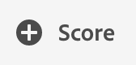

In the next step, you again have to select an Input Dataset. Let's choose the ```Recommendations Input Dataset```. 


After selecting the Input Dataset, click ```Next```.


In the next step, you need to select a dataset to which Platform will output results. In this case, select the ```Recommendations Output Dataset```.

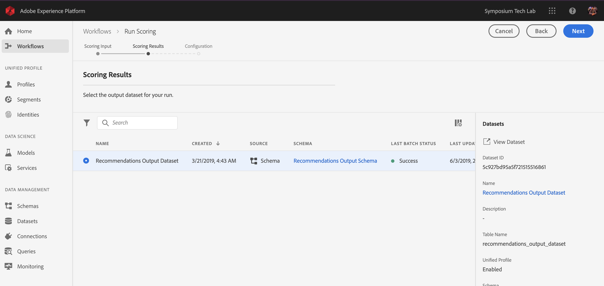

After selecting the Output Dataset, click ```Next```.


In the next screen, you can again specify/change the Model's Configuration parametres.

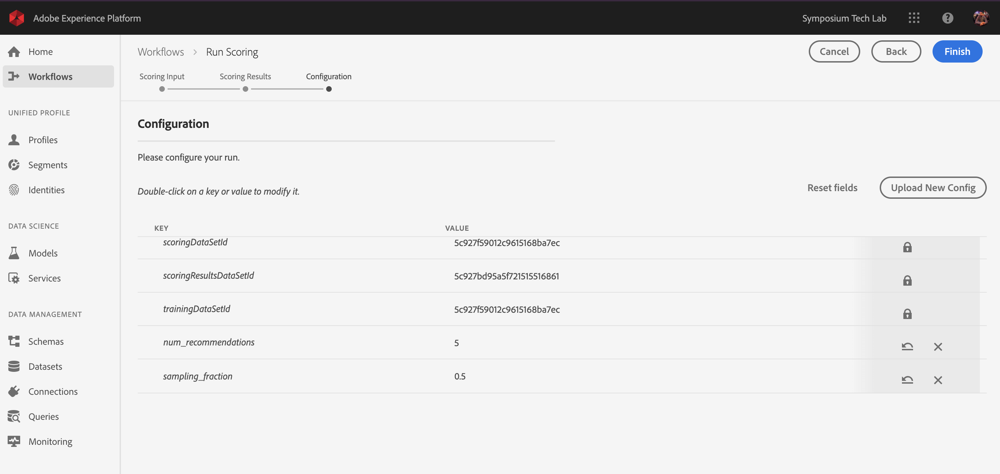

After updating the Model's Configuration parametres, click ```Finish```.


A ```Scoring Run``` is now created, and has a status of ```Pending```.

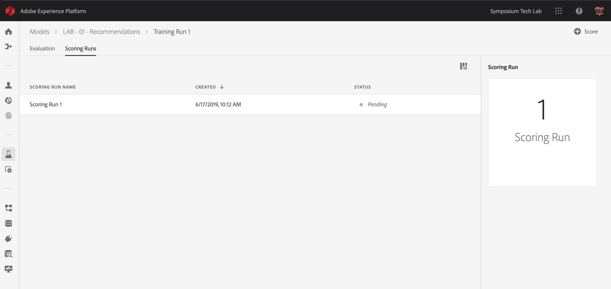

After 1-2 minutes, your Scoring Run's status will change to ```Running```.

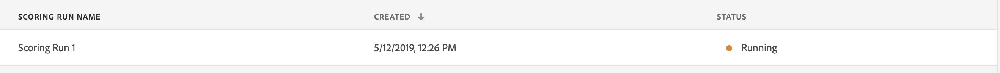 

And 1-2 minutes later, the Scoring Run's status will change to ```Complete```.

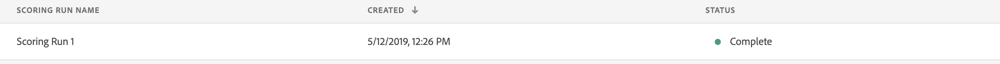

And finally, you can preview the results by selecting ```Scoring Run 1``` and click the ```Preview Scoring Results Dataset```.

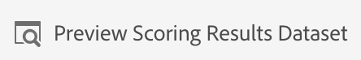

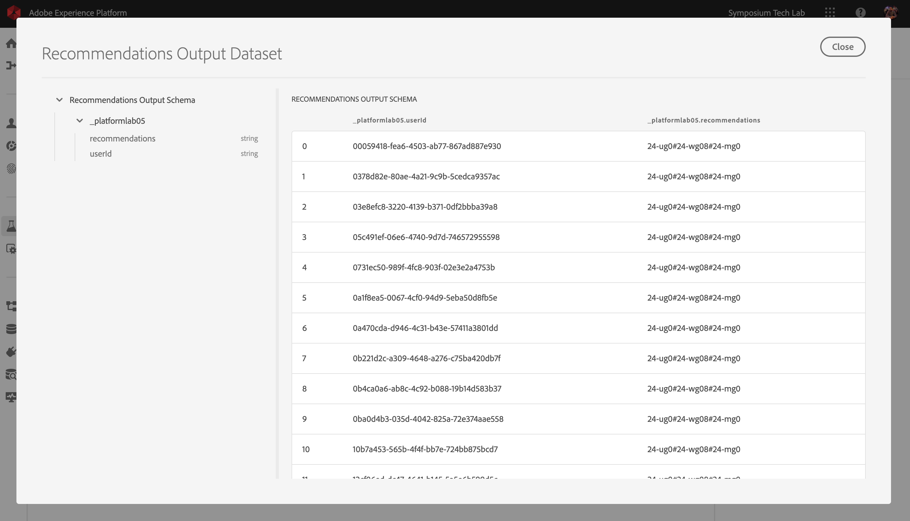

With this, you've successfully finished this exercise.

---

[Back to LAB Home](../README.md)

