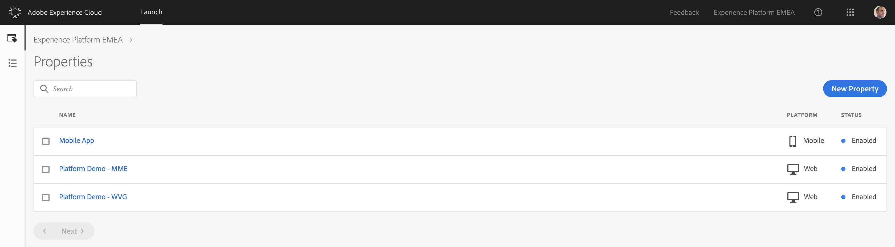
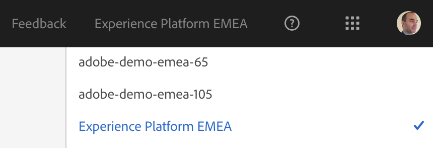
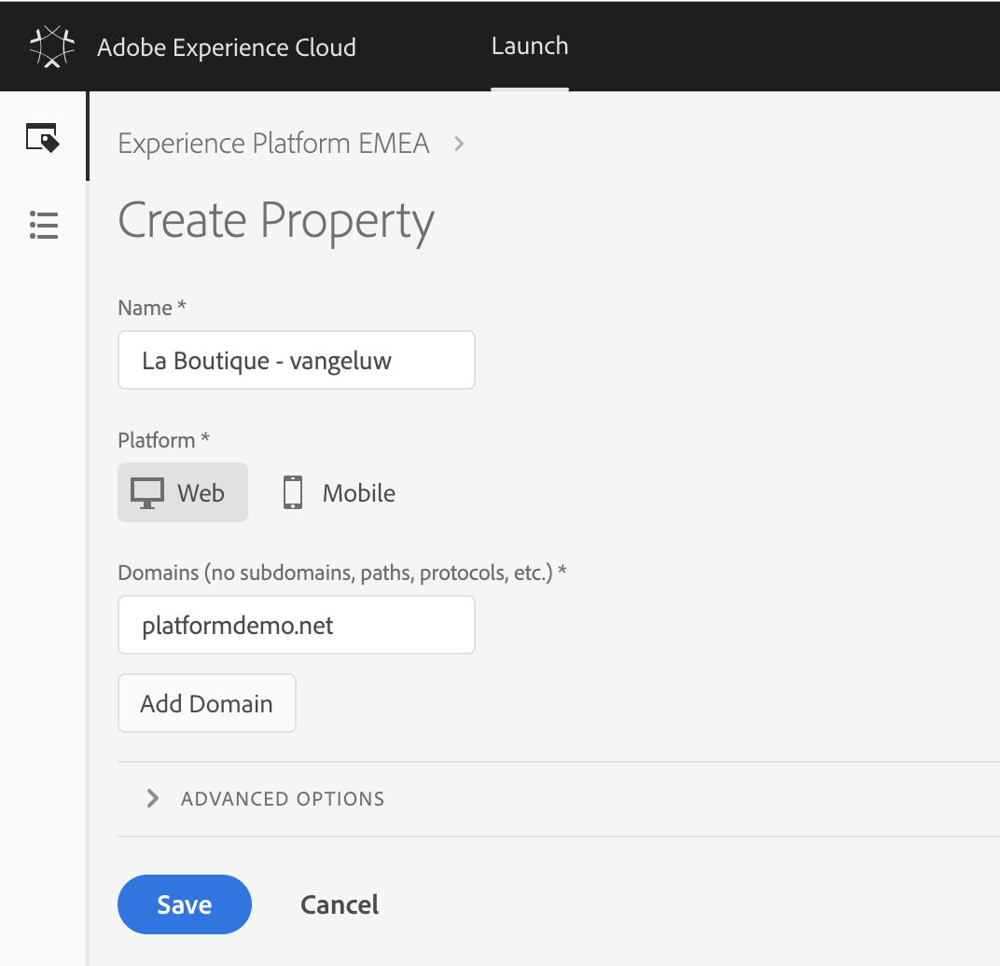

## Exercise 1.2.1 - Create a Launch Property

Go to [https://launch-demo.adobe.com/](https://launch-demo.adobe.com/) and login with your personal login details.

Select the company 'Experience Platform EMEA' in the company switcher on the top right of your screen:

Create a New Launch Property by clicking on the 'New Property'-button.

We've defined a naming convention which needs to be respected:

Name of your Launch Property: "La Boutique - **lastname**". Please replace **lastname** with your personal lastname.

Domain of your Launch Property: "platformdemo.net".

Click Save to finish configuring your property.

[Next Step: Exercise 1.2.2 - Configure Launch Extensions](./ex2.md)

