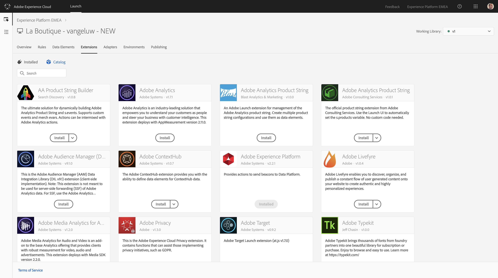

## Exercise 1.3.1 - Configure Launch Extensions

Go to [https://launch-demo.adobe.com/](https://launch-demo.adobe.com/) and login with your personal login details.

Open your Launch property.
From the property landing page, go to Extensions.


In Extensions, go to Catalog.


The Extensions Catalog holds all of the available Launch Extensions.


Search for "Experience Cloud ID Service" and click "Install".


Accept the default settings and click "Save".


Go back to the Extensions Catalog, search for "Adobe Experience Platform" and click "Install".


In the Adobe Experience Platform extension window, click the "Create a streaming endpoint"-button.

We're now going to create a custom streaming endpoint. A custom streaming endpoint can be used to collect data from channels where Adobe Analytics isn't installled. For instance, it's possible to implement this streaming endpoint on a website where Google Analytics is implemented or on IOT devices like Amazon Dash buttons, Estimote iBeacons, a Telco's set-top boxes, in-car dashboards and many more. This offers us the ultimate flexibility in data capture.


To create a streaming endpoint, all the fields are prepopulated. However, we need to change the naming of the endpoint.


In the fields Name and Source ID, please add your ldap as indicated below:
The correct naming convention is:

  * For Name: **lastname** Launch Streaming Endpoint
  * For Source ID: **lastname** Launch

Attention: don't put any dashes (-) in the Name and Source ID, this generates a validation error.


After creating your own streaming endpoint, select your specific endpoint from the dropdown list.


Save your changes.

Go back to the Extensions Catalog, search for Adobe Analytics and click "Install".



In the Adobe Analytics extension window, first of all we need to select the Adobe Analytics Report Suite.
The report suite to use is called ```epmeaplatformdemo```.


Next, we have to define the General Settings, which includes the Tracking Server we'll be using.
As a Tracking Server, please use **experienceplatformemea.sc.omtrdc.net**.


Scroll down until you find the "Adobe Audience Manager" - menu.
Check the checkbox top activate the option "Automatically share Analytics Data with Audience Manager" and in the Audience Manager Subdomain menu, type **experienceplatform**.


Save your changes.

You now have 4 extensions installed in your Launch property:


Your Launch property now has all required extensions!

### 1.3.2 Configure Launch Rules
[Launch Rules](./ex5.md)


