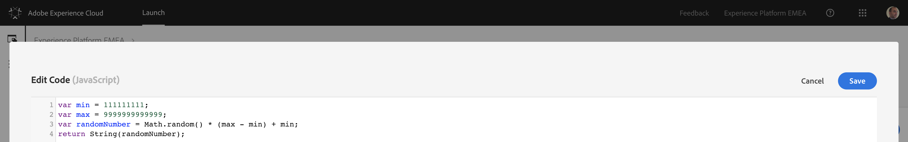

## Exercise 1.2.3 - Configure Launch Data Elements

Go to [https://launch-demo.adobe.com/](https://launch-demo.adobe.com/) and login with your personal login details.

After creating and configuring the extensions, we're now ready to configure Data Elements. 

In the Launch UI, go to Data Elements and click on "Create New Data Element".


The first data element we need is called **customerEmail**. When a customer creates a profile on the La Boutique website, we'll link the customer's email address to his or her customer profile in Platform.

| Name          | Extension     | Data Element Type  | Local Storage Item Name | Storage Duration |
| ------------- |:-------------:| :-----------------:| :----------------------:| :--------------: |
| customerEmail | Core          | Local Storage      | email                   | Session          |
    


Save your new data element.

The next data element is called **customerECID**. We'll assign the value of the client-side ECID to this data element.

| Name          | Extension     | Data Element Type  | Storage Duration |
| ------------- |:-------------:| :-----------------:| :--------------: |
| customerECID  | Core          | Custom Code        | Session          |


Open the Editor by clicking on "Open Editor".

This is the custom code to enter here:

```javascript
return Visitor.getInstance('907075E95BF479EC0A495C73@AdobeOrg')._fields['MCMID'];
```


Save your code fragment and then click "Save" again to save your data element configuration.

The next data element will be **customerFirstName**. When a customer creates a profile on the La Boutique website, we'll link the customer's first name to his or her customer profile in Platform.

| Name              | Extension     | Data Element Type  | Local Storage Item Name | Storage Duration |
| ----------------- |:-------------:| :-----------------:| :----------------------:| :--------------: |
| customerFirstName | Core          | Local Storage      | firstname               | Session          |


Save your new data element.

Next: **customerLanguage**. We'll capture the customer's preferred language by taking it from the browser's settings.

| Name              | Extension     | Data Element Type       | JavaScript variable name | Storage Duration |
| ----------------- |:-------------:| :----------------------:| :-----------------------:| :--------------: |
| customerLanguage  | Core          | JavaScript Variable     | navigator.language       | Session          |


Save your new data element.

Next: **customerLastName**. When a customer creates a profile on the La Boutique website, we'll link the customer's last name to his or her customer profile in Platform.

| Name              | Extension     | Data Element Type  | Local Storage Item Name | Storage Duration |
| ----------------- |:-------------:| :-----------------:| :----------------------:| :--------------: |
| customerLastName  | Core          | Local Storage      | lastname                | Session          |


Save your new data element.

Next: **customerLoggedIn**. When a customer is logged in on the La Boutique website, we'll set this variable to Yes and use that condition in a Launch Rule configuration.

| Name              | Extension     | Data Element Type  | Local Storage Item Name | Storage Duration |
| ----------------- |:-------------:| :-----------------:| :----------------------:| :--------------: |
| customerLoggedIn  | Core          | Local Storage      | loggedin           | Pageview         |


Save your new data element.

Next: **pageHitId**. We need a unique HitId on every call to Platform.

| Name          | Extension     | Data Element Type  | Storage Duration |
| ------------- |:-------------:| :-----------------:| :--------------: |
| pageHitId     | Core          | Custom Code        | Pageview         |


Open the Editor by clicking on "Open Editor".

This is the custom code to enter here:

```javascript
var min = 111111111;
var max = 9999999999999;
var randomNumber = Math.random() * (max - min) + min;
return String(randomNumber);
```


Save your code fragment and then click "Save" again to save your data element configuration.

Next: **pageName**. On every new pageload, we need to capture the page name and send it to AA, AAM and Platform.

| Name              | Extension     | Data Element Type  | Attribute | Storage Duration |
| ----------------- |:-------------:| :-----------------:| :--------:| :--------------: |
| pageName          | Core          | Page Info          | Title     | Pageview         |


Save your new data element.

Next: **pageUrl**. On every new pageload, we need to capture the URL and send it to AA, AAM and Platform.

| Name              | Extension     | Data Element Type  | Attribute | Storage Duration |
| ----------------- |:-------------:| :-----------------:| :--------:| :--------------: |
| pageUrl           | Core          | Page Info          | URL     | Pageview         |


Save your new data element.

Next: **pageType**. On every new pageload, we need to capture the type of the page.

| Name               | Extension     | Data Element Type     | JavaScript variable name        | Storage Duration |
| ------------------ |:-------------:| :--------------------:| :------------------------------:| :--------------: |
| pageType           | Core          | JavaScript Variable   | digitalData.category.siteSection| Pageview         |


Save your new data element.

Next: **productCategory**. For every product view, we need to capture the product's category and send it to Platform.

| Name              | Extension     | Data Element Type       | JavaScript variable name    | Storage Duration |
| ----------------- |:-------------:| :----------------------:| :--------------------------:| :--------------: |
| productCategory   | Core          | JavaScript Variable     | digitalData.product.category| Pageview         |


Save your new data element.

Next: **productName**. For every product view, we need to capture the product's name and send it to Platform.

| Name              | Extension     | Data Element Type       | JavaScript variable name    | Storage Duration |
| ----------------- |:-------------:| :----------------------:| :--------------------------:| :--------------: |
| productName       | Core          | JavaScript Variable     | digitalData.product.name    | Pageview         |


Save your new data element.

Next: **productPrice**. For every product view, we need to capture the product's price and send it to Platform.

| Name              | Extension     | Data Element Type       | JavaScript variable name    | Storage Duration |
| ----------------- |:-------------:| :----------------------:| :--------------------------:| :--------------: |
| productPrice      | Core          | JavaScript Variable     | digitalData.product.price   | Pageview         |


Save your new data element.

Next: **productImageUrl**. For every product view, we need to capture the product's image URL and send it to Platform.

| Name              | Extension     | Data Element Type       | JavaScript variable name     | Storage Duration |
| ----------------- |:-------------:| :----------------------:| :---------------------------:| :--------------: |
| productImageUrl   | Core          | JavaScript Variable     | digitalData.product.imageUrl | Pageview         |


Save your new data element.

Next: **productInteraction**. For every product view, we need to capture the type of interaction (View, Add To Cart, Purchase, etc) and send it to Platform.

| Name              | Extension     | Data Element Type       | JavaScript variable name     | Storage Duration |
| ----------------- |:-------------:| :----------------------:| :---------------------------:| :--------------: |
| productInteraction   | Core          | JavaScript Variable     | digitalData.product.interaction | Pageview         |


Save your new data element.

Next: **pageTimeStamp**. We need a unique timestamp on every call to Platform.

| Name           | Extension     | Data Element Type  | Storage Duration |
| -------------- |:-------------:| :-----------------:| :--------------: |
| pageTimeStamp  | Core          | Custom Code        | Pageview         |


Open the Editor by clicking on "Open Editor".

This is the custom code to enter here:

```javascript
var date = new Date();

var month = date.getMonth();
var day = date.getDate();
var hour = date.getHours();
var min = date.getMinutes();
var sec = date.getSeconds();

month = (month < 9 ? "0" : "") + (month+1);
day = (day < 10 ? "0" : "") + day;
hour = (hour < 10 ? "0" : "") + hour;
min = (min < 10 ? "0" : "") + min;
sec = (sec < 10 ? "0" : "") + sec;

var str = date.getFullYear() + "-" + month + "-" + day + "T" +  hour + ":" + min + ":" + sec + "Z";

return str;
```


Save your code fragment and then click "Save" again to save your data element configuration.

Next: **pageUserAgent**. For every page view, we need to capture the user device type and Operating System and send it to Platform. We use the User Agent to derive this information. More info on User Agent can be found here: [https://en.wikipedia.org/wiki/User_agent](https://en.wikipedia.org/wiki/User_agent)

| Name              | Extension     | Data Element Type       | JavaScript variable name    | Storage Duration |
| ----------------- |:-------------:| :----------------------:| :--------------------------:| :--------------: |
| pageUserAgent     | Core          | JavaScript Variable     | navigator.userAgent         | Pageview         |


Save your new data element.

You've finished configuring all required data elements!

[Next Step: Exercise 1.2.4 - Configure Platform Datasets](./ex4.md)


