## Exercise 1.3.2 - Configure Launch Rules

After creating the extensions and data elements, it's time to build our Rules.

Go to [https://launch-demo.adobe.com/](https://launch-demo.adobe.com/) and login with your personal login details.

#### Exercise 1.3.2.1 - Rule: All Authenticated Pages

In the Launch menu, go to Rules and click on "Add Rule".

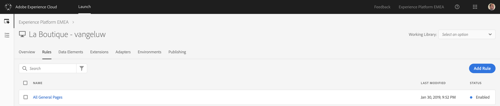

Our third rule will fire on all authenticated pages and will send Profile data to Platform.
As a name for this rule, let's use "All Authenticated Pages".

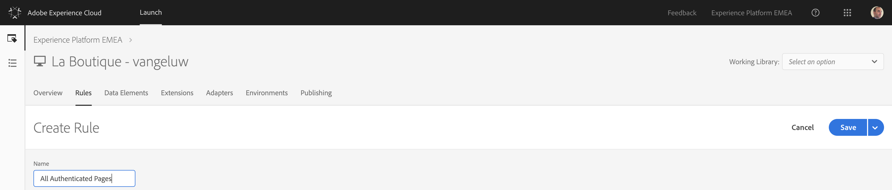

We need to configure an Event to trigger this rule, so let's click on the + icon to Add an Event.

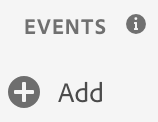

Our rule should fire on all pages, at the top of the page.

| Extension     | Event Type       | Name             | Order |
|:-------------:| :---------------:| :--------------: | :--------------: |
| Core          | Library Loaded (Page Top) | Core - Library Loaded (Page Top) | 10 |

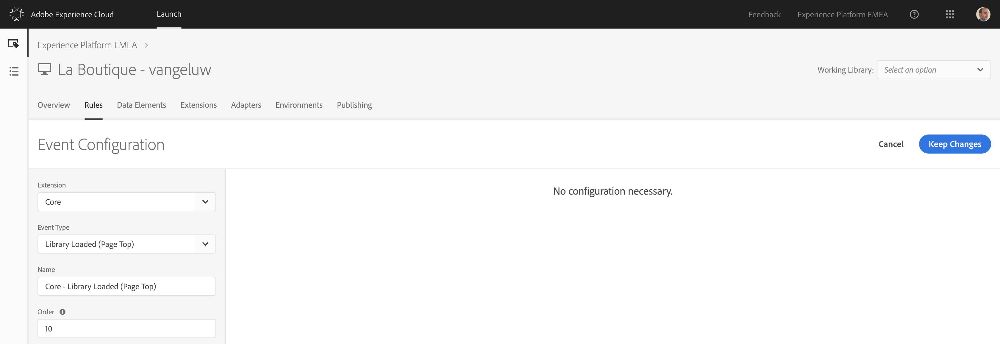

Click "Keep Changes" to save your Event Configuration.

(If you plan on taking a pause here, don't forget to click "Save" to save your changes.)

Now we need to add a condition so that this Rule only fires on the Product Pages. Click on the + icon to add a Condition

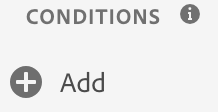

Our rule should only fire on pages where a customer is authenticated, so we're reading out the LoggedIn information from the datalayer and are comparing it to find the moment when a customer is Authenticated.

| Logic Tyoe    | Extension     | Condition Type       | Name                     | Return true if     | Equals |
|:-------------:|:-------------:| :-------------------:| :----------------------: | :----------------: | :----: |
| Regular       | Core          | Value Comparison     | Core - Value Comparison  | %customerLoggedIn% | Yes    |

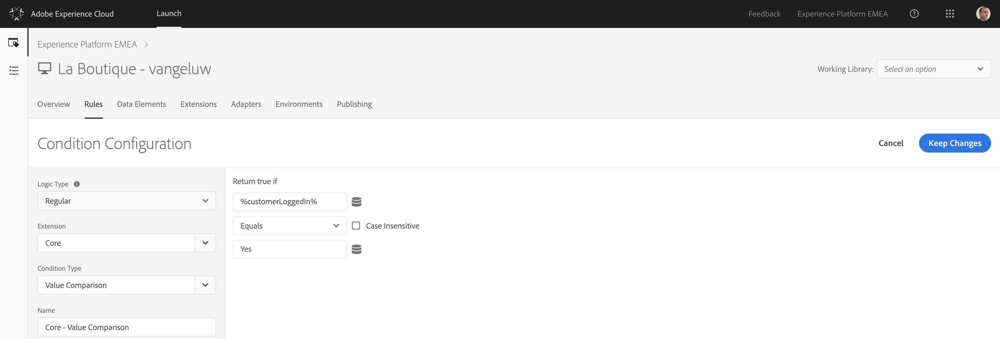

Click "Keep Changes" to save your Event Condition.

(If you plan on taking a pause here, don't forget to click "Save" to save your changes.)

After the Event and Condition, we can now define Actions to be taken.

To add an action, click on the + icon.

Our first action will be to send the beacon to Platform, by configuring the options as follows:

| Extension                   | Action Type      | Name                                    |
|:---------------------------:| :---------------:| :-------------------------------------: |
| Adobe Experience Platform   | Send Beacon      | Adobe Experience Platform - Send Beacon |

After selecting the Platform - Send Beacon option, a dataset needs to be selected. In Exercise 1.2.4, we defined the 2 datasets to use:

* Website Interaction Dataset name: 
  
  * **Website Interactions - EMEA EE Dataset (API)**

* Website Registration name: 
  
  * **Website Registrations - EMEA Profile Dataset (API)**

In this case, we need to select the Website Registrations - EMEA Profile Dataset (API) - dataset from the dropdown-list.

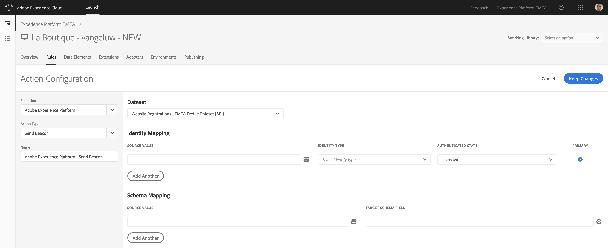

Next, in Identity Mapping, you need to define a Primary Identifier for this dataset. Our primary identifier for Website Registrations will be the email address. Additionaly, we'll add the ECID into the Identity Mapping fields. Be sure to set email as the Primary Identity! 
Configure your Identity Mapping as follows:

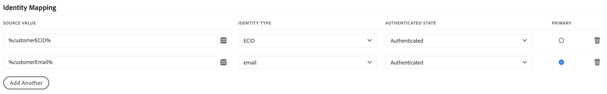

In Schema Mapping, there's a visual way of selecting XDM-fields. By clicking on this icon:

 

With a click on that icon, you're able to open up the XDM Schema that is linked to the dataset **Website Interactions - EMEA EE Dataset (API)**.

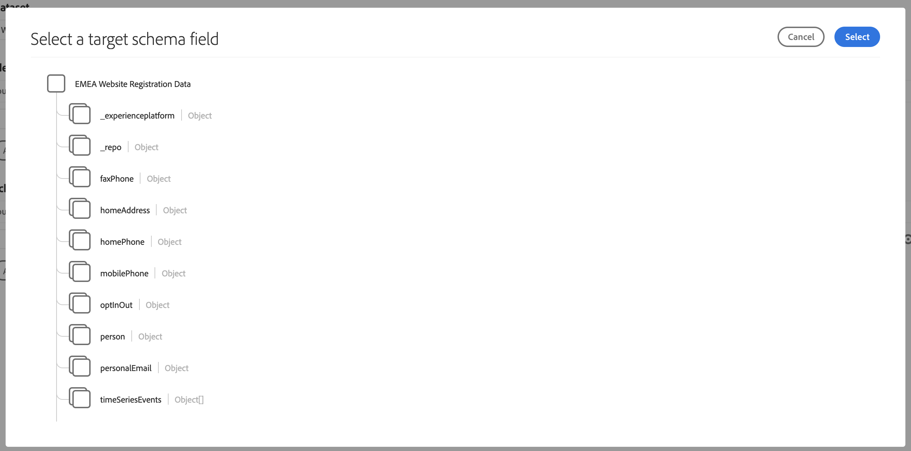

In Schema Mapping, You need to add the following Keys and Values to the Send Beacon-action:

| Source Value                                        | Target Schema Field               |
|:-------------------------------------------| :------------------ |
|%customerFirstName%|person.name.firstName|
|%customerLastName%|person.name.lastName|
|%customerEmail%|personalEmail.address|
|%customerEmail%|_experienceplatform.identification.emailId|
|%pageTimeStamp%|\_repo.createDate|

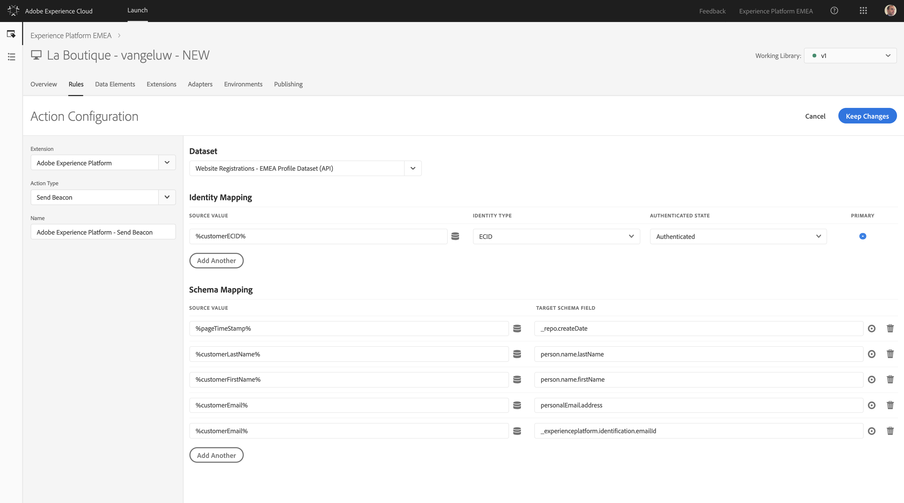

Attention! Check your configuration of the Keys to be sure that after copying, no extra spaces are added in the keys as this will generate errors in Platform.

Click "Keep Changes" to save your Action.

(If you plan on taking a pause here, don't forget to click "Save" to save your changes.)

Our second action for this rule will be the configuration of the Experience Cloud ID Service and the ID-sync between the ECID and the email ID, by configuring the Action as follows:

| Extension                   | Action Type        | Name                                           |
|:---------------------------:| :-----------------:| :--------------------------------------------: |
| Experience Cloud ID Service | Set Customer ID's  | Experience Cloud ID Service - Set Customer IDs |

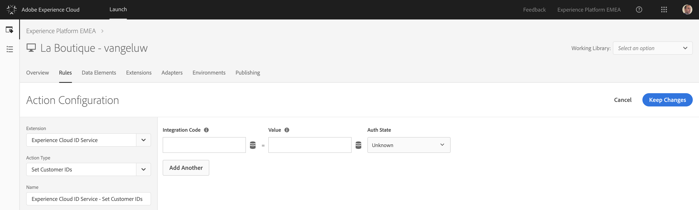

The following variables need to be configured here:

| Integration Code       | Value             | Auth State        |
|:-----------------------| :---------------- | :---------------- |
| CustomerID             | %customerEmail%   | Authenticated     |

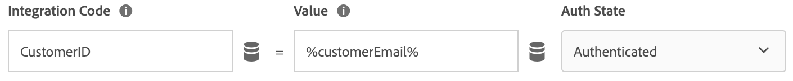

Click "Keep Changes" to save your Action.

Click "Save" to save your Rule Configuration.

With this, you've successfully finished the setup of one Rule in Launch.

### 1.3.3 Publish Launch Property
[Publish Launch Property](./ex6.md)
