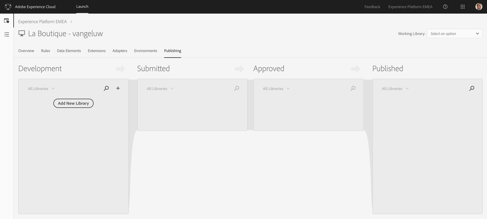
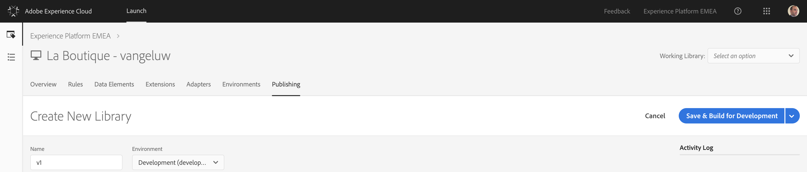
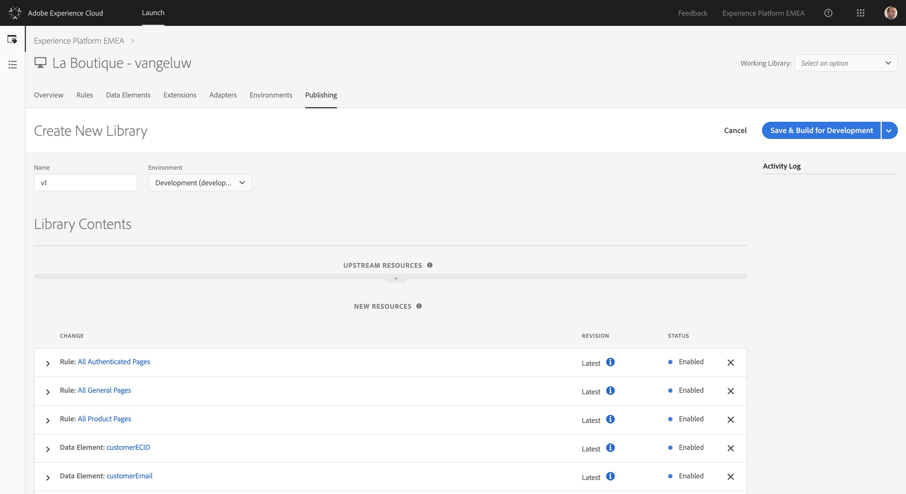

## Exercise 1.3.3 - Publish your Launch Property

Go to [https://launch-demo.adobe.com/](https://launch-demo.adobe.com/) and login with your personal login details.

In the Launch UI, navigate to the menu option "Publishing".

Click the "Add New Library"-button

Enter as Name "v1" and select the Development environment from the dropdown list.

Click on the "Add All Changed Resources"-button, after which you should see all the elements that you configured pop up in the "New Resources" list.

Click the "Save & Build for Development"-button.

Your new Library is now being built!

---
  
### 1.4 [Unified Profile](../unified_profile)

