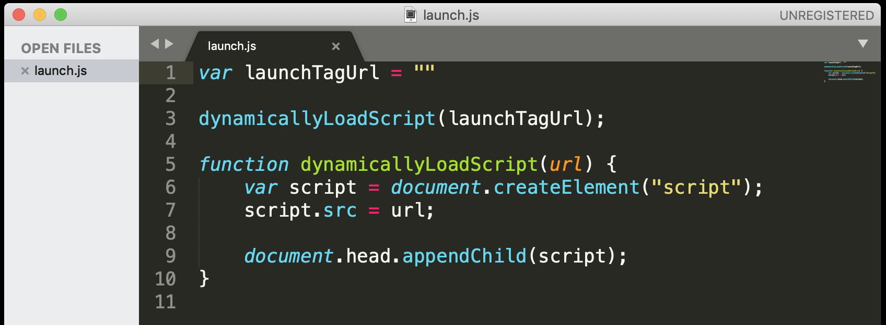
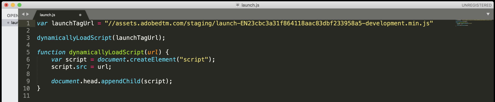

## Exercise 1.2.7 - Implement Launch Tag on La Boutique website

Go to the folder Applications > MAMP > htdocs > js and locate the launch.js file


Open the file launch.js in your favourite text editor.



Go to Line 1, where you'll see the following:

```javascript
var launchTagUrl = ""
```

On Line 1, replace "" with your launch tag:


This should be the result:

```javascript
var launchTagUrl = "//assets.adobedtm.com/staging/launch-EN23xxxxxxxxxxxxxxxxxxxxxxxxx-development.min.js"
```



Save your changes in the launch.js file and reload your La Boutique website.

After this change, your website and configuration are ready for Production!

[Next Step: Exercise 1.2.8 - Verify Data Ingestion from La Boutique website into Platform](./ex8.md)


