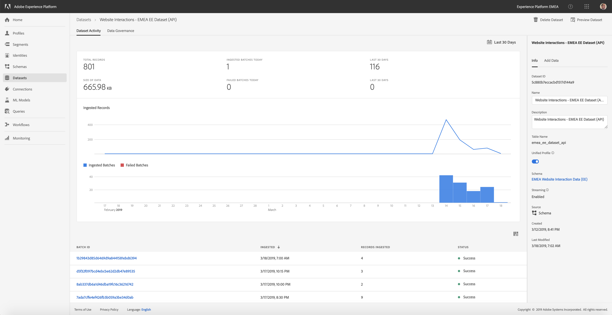

## Exercise 1.2.8 - Verify Data Ingestion from website into Platform

After implementing the Launch Tag on your website, you should start to see calls being sent towards Platform.

These calls are sent to the DCS Endpoint that you configured in exercise 1.2.2.

To verify if calls are being sent, open your website by going to [http://localhost:8888/index.html](http://localhost:8888/index.html) in Chrome and at the same time open the Chrome Developer Tools.

Open the Chrome Developer Tools on the "Network"-view and then refresh your page.

By refreshing your page, you'll see all the calls being sent from the page to various servers, including the calls to the DCS Endpoint of Platform.

To easily find the calls to Platform, you can apply a filter by entering "dcs" in the Filter-field.

This should give you 1 call to Platform, which is the call that sends in ExperienceEvent-data on every pageload.

Select the call to the DCS Endpoint, and scroll down until you see "Request Payload".

Click on "view source" to view the full raw call to Platform.

Select the full raw text and copy it.

Go to [https://jsonformatter.org/json-pretty-print
](https://jsonformatter.org/json-pretty-print
) and paste the copied raw text in the left window.

Click on "Make Pretty" to see a readable version of the call to Platform.

Next, go to to the Login/Register-page [http://localhost:8888/login-register.html](http://localhost:8888/login-register.html)

Make sure the Chrome Developer Tools-window is still open.

Enter your First Name, Last Name, Email and Password and click "Create Account".

With the "dcs"-filter in the Network-tab active, you're now seeing 2 calls being sent to Platform.

Select the first call and scroll down until you see the Request Payload.

Click on "view source" and copy the full raw payload.

Go to [https://jsonformatter.org/json-pretty-print
](https://jsonformatter.org/json-pretty-print
) and paste the copied raw text in the left window, then click on "Make Pretty" to see the full payload in a readable format.

If you see 2 calls going out to the DCS Endpoint, that means that Launch is correctly activating calls to Platform.

Now we need to verify whether these calls are successfully received by Platform.

To log in to Platform, go to [https://platform.adobe.com/home](https://platform.adobe.com/home). 

Go to "Datasets" and locate your 2 Datasets. As a reminder, the shared datasets we're using are called:

* Website Interaction Dataset name: 
  
  * **Website Interactions - EMEA EE Dataset (API)**
      

* Website Registration name: 
  
  * **Website Registrations - EMEA Profile Dataset (API)**
      

Datasets in the UI of Platform are usually updated every 15minutes.

You can immediately see if the ingestion of the last batch of data for this dataset was successful:

And by opening the "Website Interactions - EMEA EE Dataset (API)"-dataset you can see all individual ingested batches for this dataset.

By clicking on "Preview", you can see a preview of the ingested data.

You can do the same thing for the "Website Registrations - EMEA Profile Dataset (API)"- dataset:

Also have a look at the "Preview" of Profile Data to retrieve your ingested data.

If both of your Datasets have successfully received the data coming from your website, you've finished this exercise! Congratulations!

[Next Step: Exercise 3 - Data Ingestion](../data_ingestion/README.md)

