## Exercise 3 - Query Service

In this exercise, we'll have a look at how data that is available inside Adobe Experience Platform can easily be consumed by external Business Intelligence and dashboarding solutions like Tableau and Microsoft Power BI.

### Learning Objectives:

* Connect to Adobe Experience Platform Query Service
* Build a powerful visualization in Tableau, consuming Adobe Experience Platform datasets


### Lab Resources

- Adobe Experience Platform: [https://platform.adobe.com](https://platform.adobe.com)
- Tableau, which is installed on your computer


[comment]: <> (### Login details to connect to Adobe Experience Platform Query Service)


[comment]: <> (* Server: ```platformlab02.platform-query.adobe.io```)
[comment]: <> (* Port: ```80```)
[comment]: <> (* Database: ```all```)
[comment]: <> (* Username: ```DF6233FB5C538CAE0A495EF3@AdobeOrg```)
[comment]: <> (* Password: ```to be copied from Adobe Experience Platform Query Service Connection Info```)


---

### Exercise 3.1 - Connect Tableau to Adobe Experience Platform

Along with retail products, Luma also offers their customers studio/gym subscriptions with access to yoga & mindfulness courses for an active lifestyle. To understand how well Luma retain subscriptions by location & loyalty status, we can now connect to Adobe Experience Platform Query Service to visualise this within Tableau and generate a Call center Interaction Analysis. To do this, you need to login to Adobe Experience Platform and retrieve the ```Connection Info```.

Go to [https://platform.adobe.com](https://platform.adobe.com), and from the left menu, select ```Queries```.

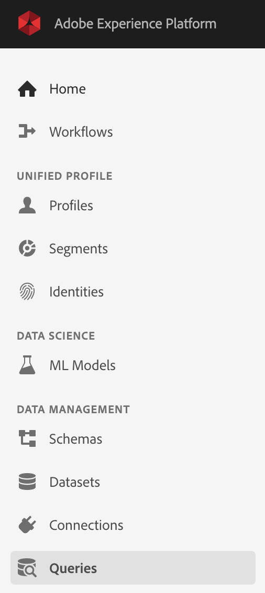

Next, you'll see this screen.

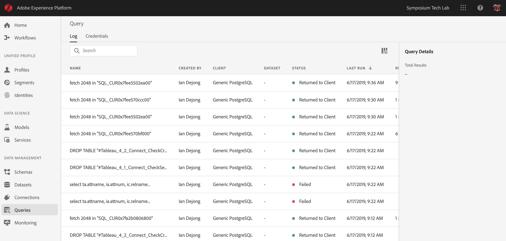

In the Queries - menu, click on ```Connection Info```.

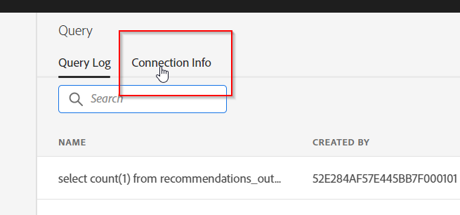

The left column of the ```Connection Info``` - screen are the ```Postgres Credentials```. Tableau will connect to Platform using these Postgres Credentials. Keep this window open. 

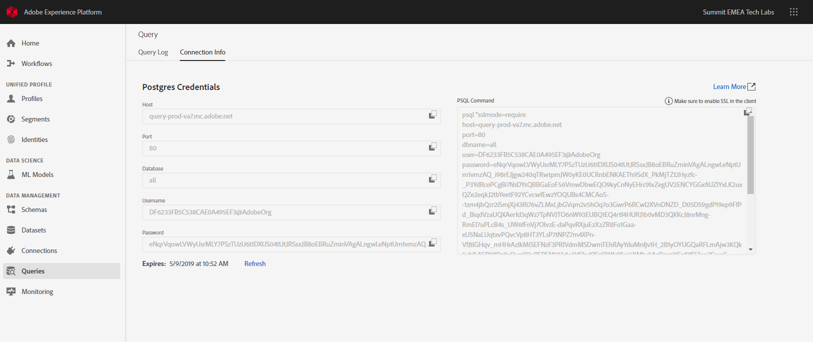

Next, let's open Tableau. On your computer's desktop, you`ll find a file with the name ```aep_symposium_tableau.twb```. Open this file by double-clicking it.

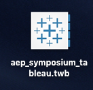

Tableau will open and load the file. Once the file is loaded, you'll see a ```PostgreSQL``` - window, waiting for you to enter the password and click Sign In.

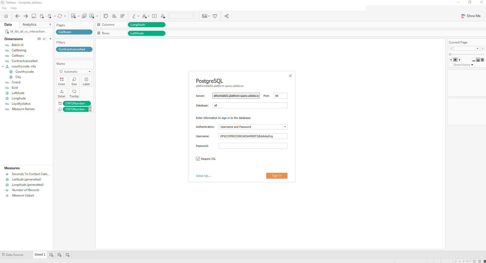

Most connection details are filled out already, except for the password. 

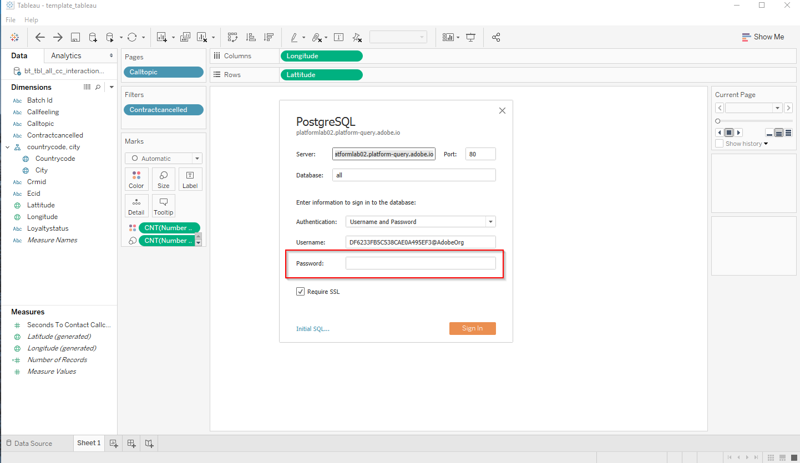

You can copy the password from the Adobe Experience Platform UI, in the ```Connection Info``` - screen that should still be open in your browser.
Go to the ```Password``` - field in the ```Connection Info``` and click on the ```copy``` - icon to copy the password.

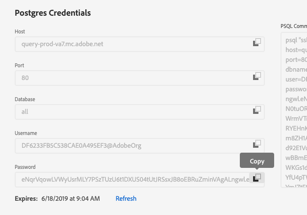

Go back to Tableau and paste the password in the PostgreSQL-connection window. Also do a quick check to see whether ```Require SSL``` is enabled.  If ```Require SSL``` is enabled, hit ```Sign in```.

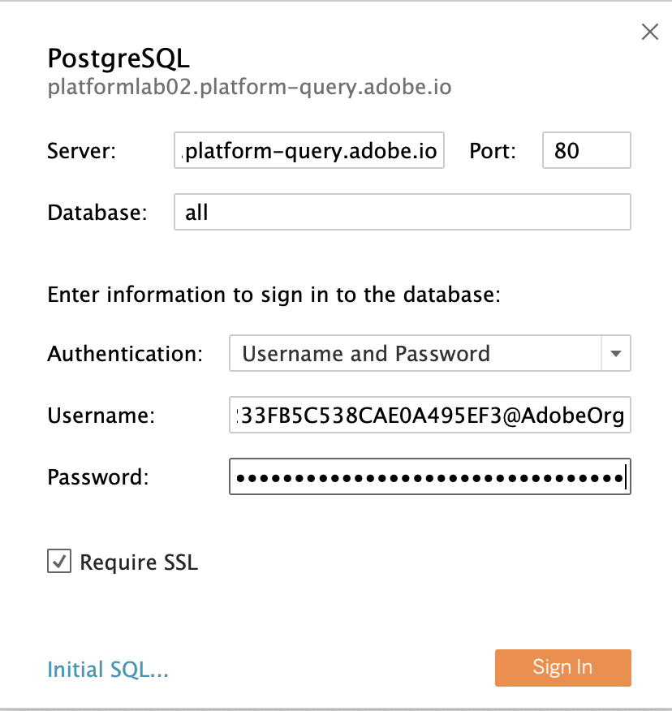

You'll now see a query being executed. 

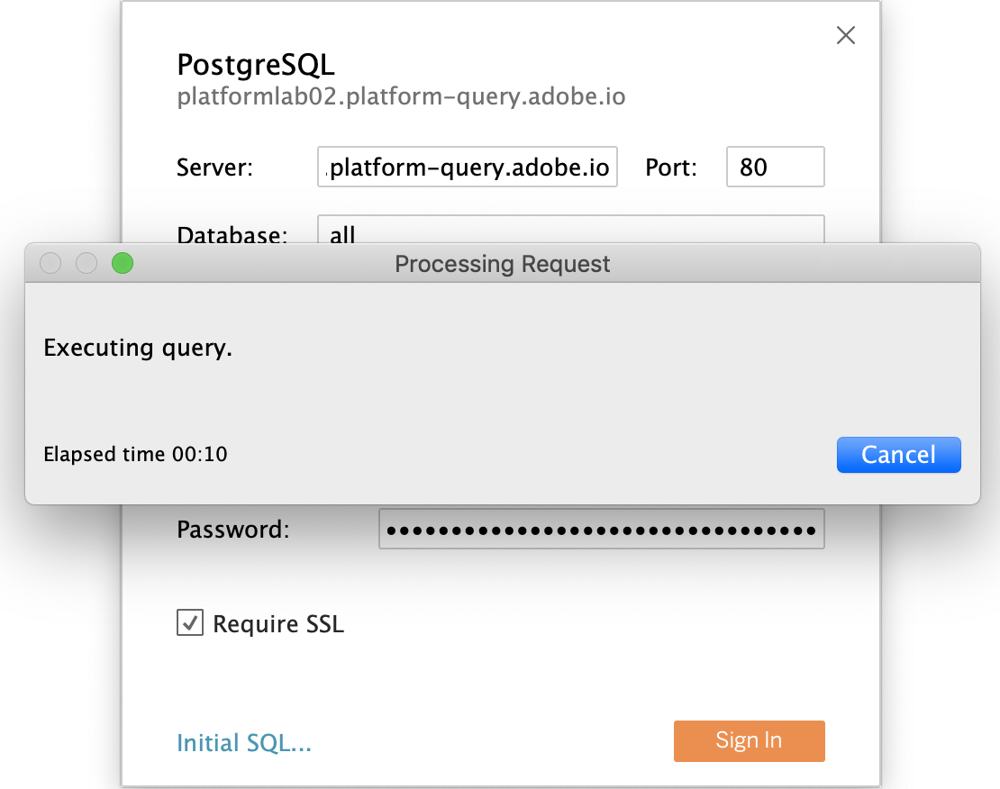

Once this query is executed, Tableau is connected to Adobe Experience Platform and can consume data that sits inside Adobe Experience Platform.

## 1.1 Adjust the CIA - Callcenter Interaction Analysis

In the Tableau workbook, you're now seeing a map of Australia and on that map, you're seeing dots. All these dots are based on latitude/longitude coordinates from Customer Profiles that are part of Adobe Experience Platform's datasets. The size of each dot is an indication of a number of calls that have taken place in Luma's call center for a specific call topic.

As we're interested to see information for calls that were focused at contract discussions, let's change the call topic to ```contract```. You can do this by clicking on the right arrow top right and selecting ```contract``` in the dropdown list. 

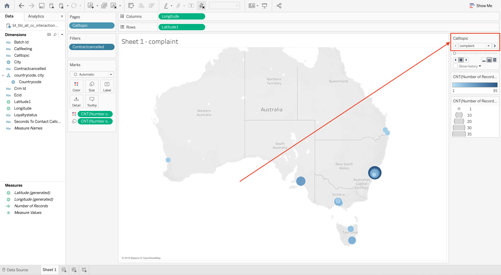

Next, we're interested in seeing information that focuses at the number of calls that lead to a customer really cancelling their contract. To do this, we need to apply a filter.

In ```Filters```, we already have a filter prepared: ```Contractcancelled```.  You now need to update this filter to only show the calls during which a contract was cancelled. To do this, double-click the ```Contractcancelled``` - filter.

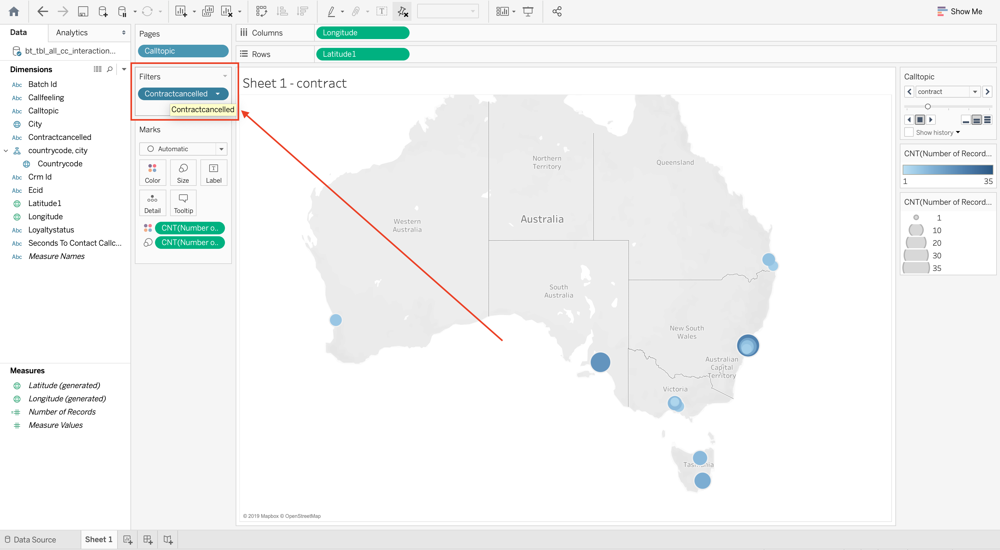

Uncheck ```no```, to only leave ```yes``` activated. Next, click ```Apply``` followed by ```OK```.

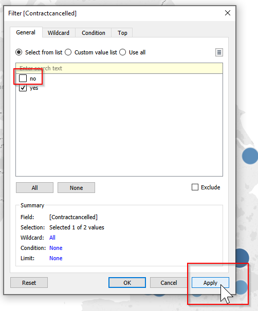

Next, we'd like to have a cleaner visualization. Let's change the color scheme in Tableau.
To change the color, double-click on the ```blue color-bar``` on the right side of your screen.

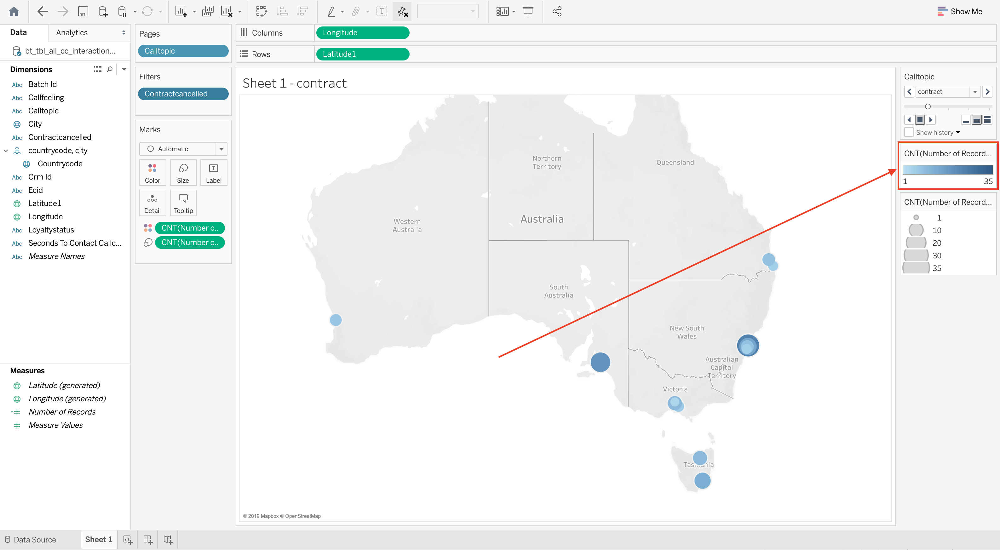


Out of the dropdown-list, select ```Orange``` and click ```OK```. The visualisation will now update.

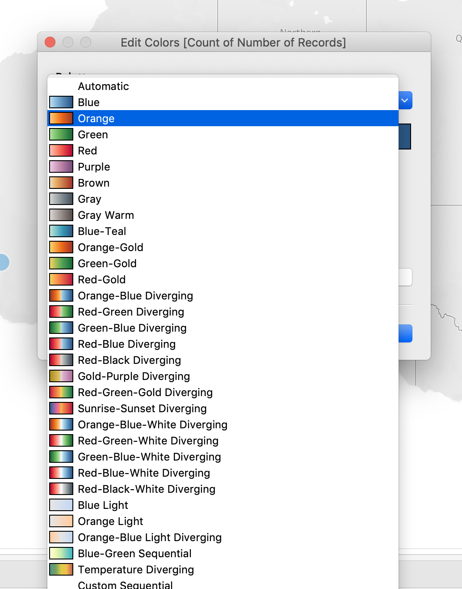

Next, you need to include the loyalty status to enrich the dashboard. Adding the loyalty status of customers gives insight in what kind of customer cancelled their contract. 

From the left column, in ```Dimensions```, select ```Loyaltystatus```, drag it to the ```Marks```- box and drop it there.

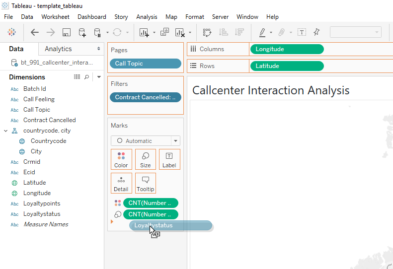

By moving your mouse over the bubbles on the map, you will see the loyalty status combined with the callcenter interactions around contract discussions that lead to a contract being cancelled.

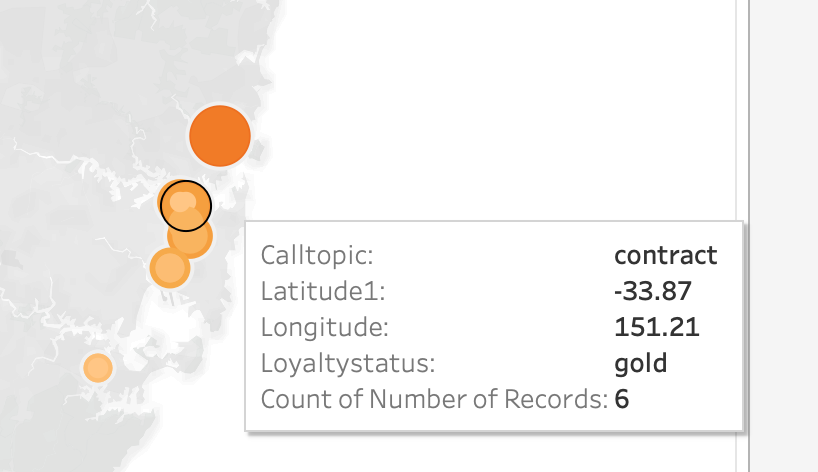

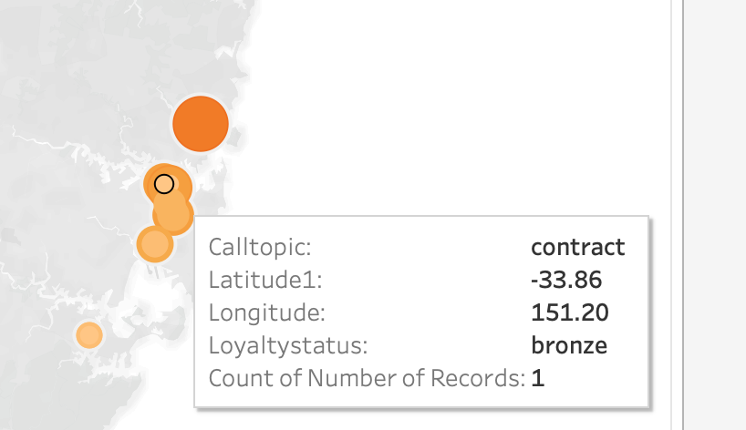

With this, you've used Experience Event data combined with Profile data that is available in Adobe Experience Platform to build a powerful visualisation in a 3rd party, non-Adobe solution, using Adobe Experience Platform Query Service.
As you've noticed, your data is always your data and thanks to Adobe Experience Platform, you can consume your data through any solution inside or outside of Adobe.

---
Next Exercise: [Exercise 4 - Data Science Workspace](../dsw/README.md) 

[Back to LAB Home](../README.md)

